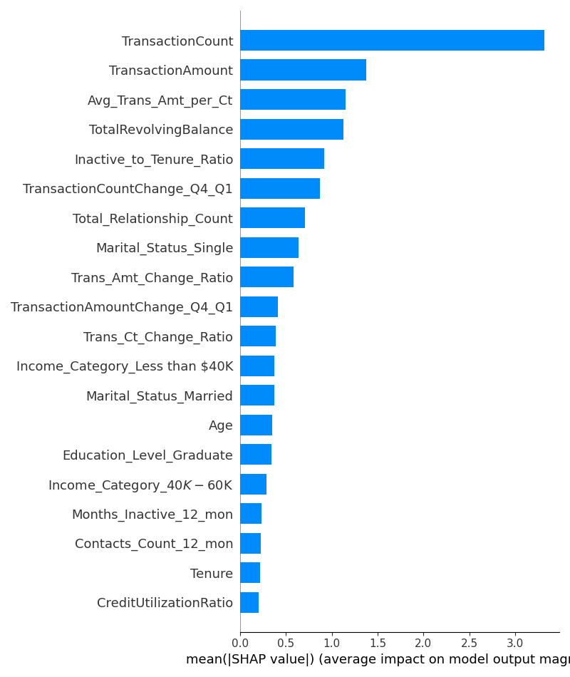
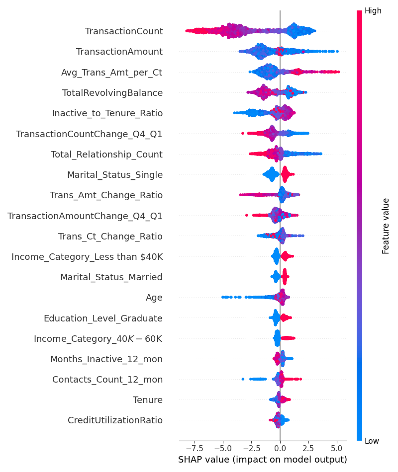
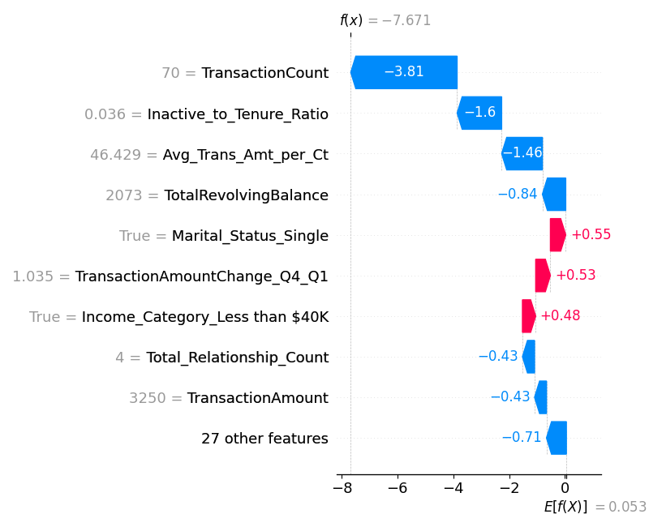

# Customer Churn Prediction & Behavioral Analytics

## Project Overview

This project develops a machine learning pipeline to predict customer churn for a consumer credit card portfolio. The solution identifies key behavioral and demographic drivers of attrition, enabling the business to proactively engage at-risk customers.

## Methodology

1.  **Data Ingestion & Cleaning:** Raw data was loaded and cleaned, with a focus on resolving data leakage by removing pre-processed "Naive Bayes" columns.
2.  **Feature Engineering:** New features such as 'Avg_Trans_Amt_per_Ct' and 'Inactive_to_Tenure_Ratio' were created to capture customer engagement.
3.  **Model Training:** XGBoostandRandomForest models were trained using oversampled data (SMOTE) to handle class imbalance, with XGBoost selected as the final model due to its superior performance.
4.  **Model Explainability:** The SHAP library was used to interpret model predictions, providing actionable insights into the key drivers of churn.

## Key Findings

The analysis revealed several critical factors influencing customer churn. The following visualizations, generated from the trained model, summarize these findings:

**1. Feature Importance:** This plot identifies the top features driving churn predictions. It shows that transactional behavior and credit utilization are the most influential factors.
``

**2. Prediction Summary:** This summary plot provides a detailed view of how each feature's values affect the churn probability, confirming the directional impact of each variable.
``

**3. Individual Prediction Explainability:** These plots demonstrate how the model's prediction for a single customer is calculated, a key capability for business trust and decision-making.
``

## Getting Started

To run this project, clone the repository and install the required libraries:
## pip install -r requirements.txt

Then, run the main scripts from the project's root directory:
## python src/train_model.py
## python src/explain_model.py

The generated visualizations will be saved to the images/ folder.
## Key Findings

The analysis revealed several critical factors influencing customer churn. The following visualizations, generated from the trained model, summarize these findings:

### 1. Feature Importance

This plot identifies the top features driving churn predictions. It shows that transactional behavior and credit utilization are the most influential factors.

### 2. Prediction Summary

This summary plot provides a detailed view of how each feature's values affect the churn probability, confirming the directional impact of each variable.

### 3. Individual Prediction Explainability

These plots demonstrate how the model's prediction for a single customer is calculated, a key capability for business trust and decision-making.

**Waterfall Plot:**

